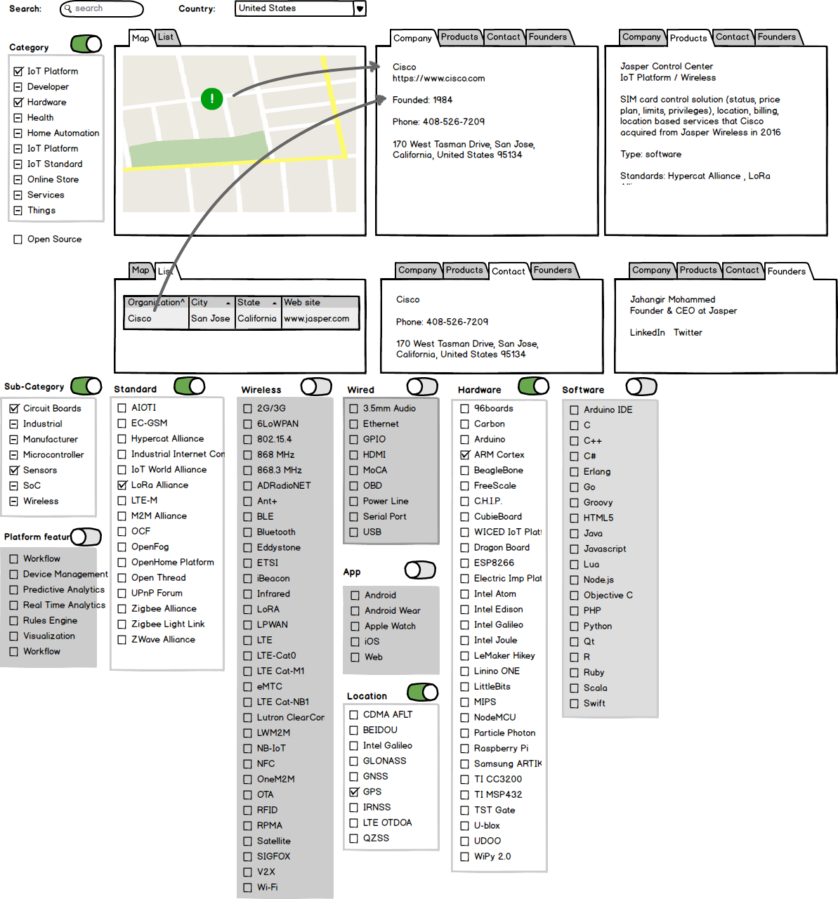

# iot_map

This is code from a few years ago for a node.js "interactive" map of all things IoT around the world. 

I stopped working on it and just putting it on github for my safe keeping and may look at it again.

If you clone this, it likely won't work at all so I wouldn't even bother.

I will need to push my Mongo dump as well which has all of the company and people information.

The `docs/IoT Thing of Things.xlsx` is a spreadsheet of companies and products that I hadn't yet added into Mongo. Kind of a backlog if you will.

### Setup

1. Create a `.env` file in the root folder, replacing `your_key` with your Google Maps API key

```
GOOGLE_MAPS_API_KEY=your_key
```

2. Create a session secret, ChatGPT suggested this:

```shell
cat /dev/urandom | tr -dc 'a-zA-Z0-9' | fold -w 32 | head -n 1
```

- add the output to your `.env` file

```
SESSION_SECRET=your_session_secret_here
```

- this is how the code accesses the session secret from the environment variable:

```
const session = require('express-session');
require('dotenv').config(); 

app.use(session({
    secret: process.env.SESSION_SECRET,
    resave: true,
    saveUninitialized: true
}));
```

3. Add `.env` to `.gitignore`

Old notes in [docs/setup.md](docs/setup.md)

### Permit your IP to access the Google API

1. Go to: https://whatismyipaddress.com/
2. Go to https://console.cloud.google.com/apis/credentials
3. Under `API Keys`, click your key
4. Under `Set an application restriction` click `IP Addresses`
5. Under `API address restrictions` add your IP from step 1

### Mockup
 


---

countries/#
countries/ca
countries/canada

countries/canada/states

countries/canada/city/toronto
city/toronto
